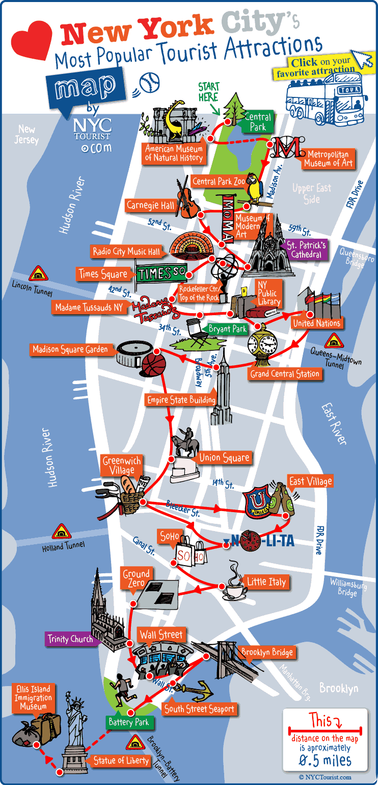

# Tableau-Challenge

## City map Analysis
It appears that the most frequetly used start and end stations are in the southern half of the manhattan area. Most of the tourist attractions, main city areas, workplaces, colleges/universities and financial district are in the area south of Central Park, correspondin to the stations with the most activity.

Below are 2 images which clearly indicated points of interest and the geographic population the course of a day. This matches up with the most used stations.

## Phenomenon 1

A few users end their Journey in Jersey City, but none start there!

This is a rather strange phenomenon. If someone travelled all the way to Jersey city then why would they not travel back, and therefore have a start Journey from Jersey.

## Phenomenon 2

Reducing Memberships towards winter. My data is only from June until the end of September.

We can see the Memberships start to decline as we move away from Summer. This could be due to the weather getting colder, so users would rather not use Bikes in the colder months. Unfortunately my data does not include winter months. This is also supported by an increase of casual users which may be the same people who had memberships using the bikes as casual users for some journeys.

## Phenomenon 3
We can clearly see the busiest hours in Manhattan both for start and End Journeys. As start and end time charts seem to line up nicely for hours, this is indicative that most journey durations are under an hour long.

The times match nicely with this beating heart visualision of the Manhattan population throughout the day.

